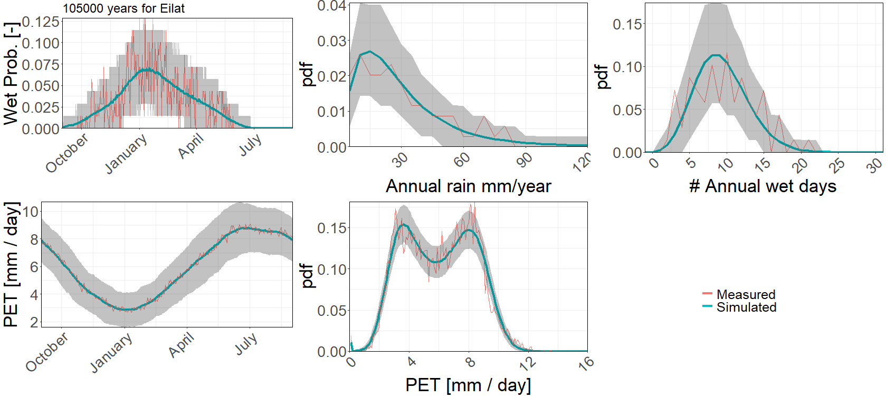
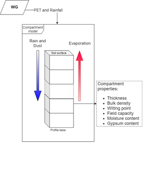
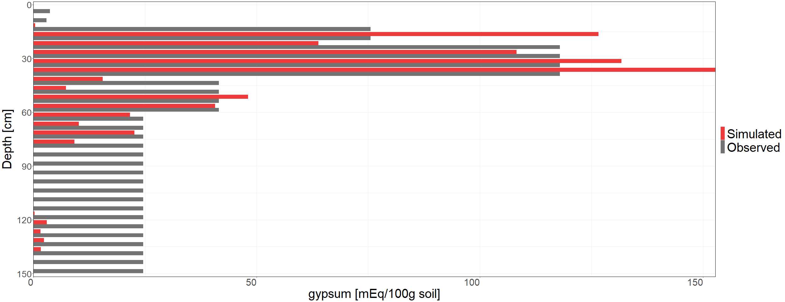
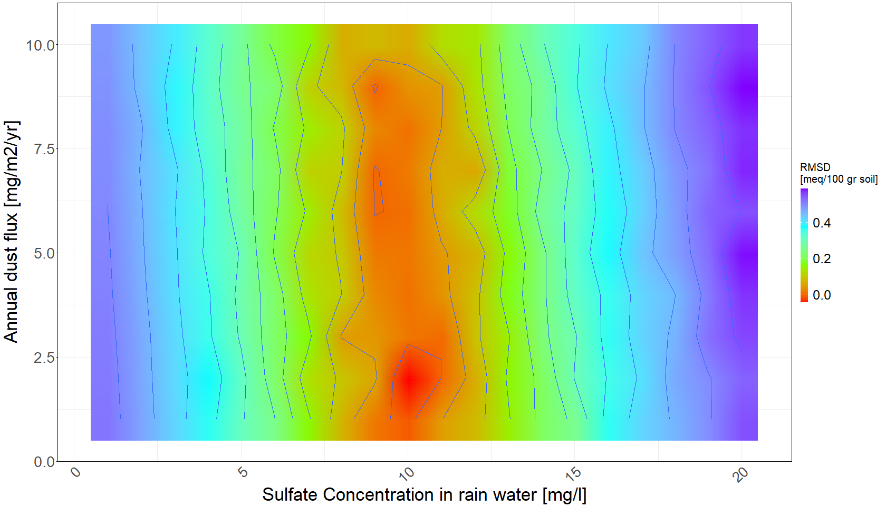
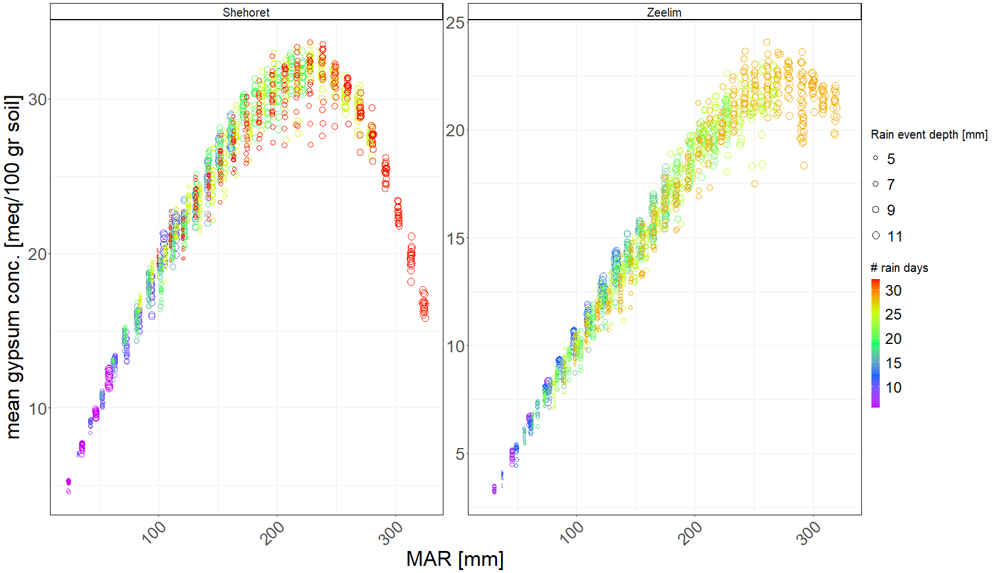
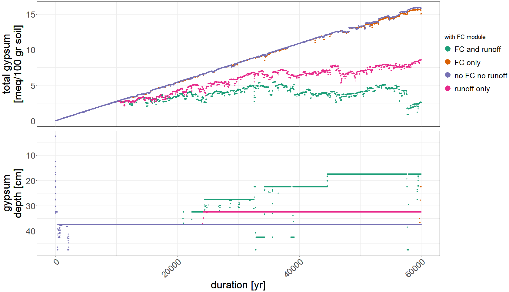
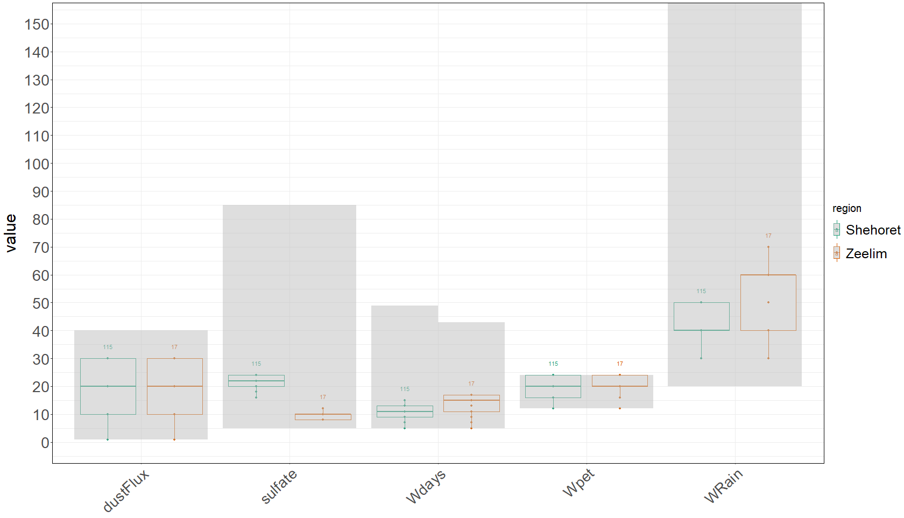

# Calgyp
Calgyp is a model designed to calculate the the concentration and dispersion of gypsum (CaSO4 H2O)  in a soil column. The model is given a daily rainfall series supplied by a stochastic weather generator and the flux of sulfate (SO4) and calcium (Ca). Ultimately, the model can be used to identify the required mean annual rainfall needed to create the soil profiles we observe today in Eilat and Dead sea area, and thereby evaluate paleoclimate. 
  
  

> gypsum accumulation in a soil profile with time as a response to daily rain and evaporation values supplied by the weather generator. 

 
## Operation

 1. Weather Generator  
	+ This section is responsible for creating a daily rainfall series of predefined length which represents the statistical climate properties in a selected meteorological station.  
	 + *evapostats\RainGen.R*: Is responsible for getting the meteorological data from the IMS using *GetImsRain()* and generate the wet and dry days probabilities using markov chain algorithm    in *CalculateProbabilities()*. The *GenerateRainSeries(numOfSeries)* function generates a series of desired length.
	 
	 this code creates daily rain from a weibull distribution:
	 
		#create matrix with weibull values for depth
		weibull = matrix(rweibull(365 * numOfyears, shape, scale) + DepthLimit, nrow = numOfyears, ncol = 365);

		#matrix with random values 
		randMat = matrix(runif(365 * numOfyears)*factor, nrow = numOfyears, ncol = 365);
		SynthRain = matrix(0, nrow = numOfyears, ncol = 365, dimnames = list(1:numOfyears, 1:365))

		for (days in 2:ncol(SynthRain)) {
		SynthRain[, days] = as.numeric((SynthRain[, days - 1] & (randMat[, days] < DaysProb$PWAW[days])) | (!SynthRain[, days - 1] & (randMat[, days] < 				DaysProb$PWAD[days])));
		}

		#addd amounts
		SynthRain[which(SynthRain == 1)] = weibull[which(SynthRain == 1)];

WG results for Eilat station  
  

 2. Soil hydrological model  C++
	A c++ model which simulate a soil column divided into compartments of a specified thickness.   Every iteration represents a daily routine of moisture addition and evaporation according to the daily rain ane potential evaporation supplied by the weather generator. The model is located in the *Calcyp* directory
	 - [Calcyp/CSM.cpp](Calcyp/CSM.cpp) - The main function is  *CSM::Calculate()* responsible for calculating the daily water balance. Distribute the moisture between the compartments represent the soil profile. 
	 - [Calcyp/Compartment.cpp](Calcyp/Compartment.cpp) - represent a compartment object. The properties of the compartment are soil parameters, moisture, and gypsum concentration. *Compartment::solubility()* calculates the equilibrium and return the accumulated gypsum
	 
	 
 

3.  Model Analysis 
	+ Functions.R contains the function *CalcGypsum()* which wrap the *CSM::calculate()* in an R environment.
	The analysis include optimization as in *evapostats/HoloCalibration.R*.
	
			print("run model")   
			Rcpp::sourceCpp('C:/Users/liorst/source/repos/evapocalc/Calcyp/CSM.cpp', verbose = TRUE, rebuild = 0);      
			cppModule <- new(CSMCLASS);  
			list = cppModule$Calculate(raindata$rain, raindata$PET, duration, Depth, thick, wieltingPoint, nArea, FieldCapacity, DustGyp, AETFactor, verbose, dustFlux / 			10000 /365, rainCa, rainSO4,withFC);  

 + This allows for fast calculation alongside comfortable model analysis.

# Output and results

Calculated profile and a real profile observed in Shehoret stream Israel
 
 
 
 Calibration results for optimal SO4 concentration in rain water and annual dust flux
  

Sensitivity analysis for annual rain
  

gypsum accumulation with time
  

  
 Final results are the assesment of the pleistocene climate (60,000 Years ago) appear hear:
 

The plot shows that the mean annual rainfall in eilat was around 40 mm, twice the current value. In addition, dust flux was also higher.
Climate in Sedom area was also more humid the today
 
 

    

	

    

